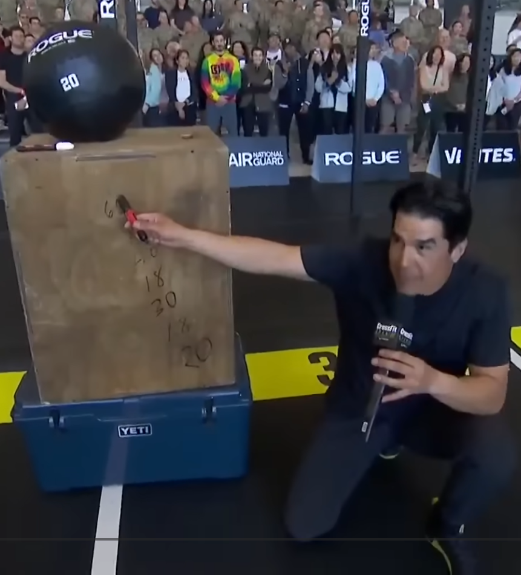

I started CrossFit at the end of April last year. I showed up three days a week,
was completely destroyed, and spent most of the following week wondering why I had
done this to myself. Gradually the soreness became manageable, some movements started
clicking, and I found myself going four, then five days a week without needing a
full day of recovery just to walk down stairs.

So naturally, ten months in, I signed up for the Open.

## What Is the CrossFit Open?

For the uninitiated: the Open is a worldwide online competition run by CrossFit every
year. Anyone can enter. You do the same workouts as the top athletes in the world,
submit your score, and get ranked globally. The gap between you and those athletes
will be humbling. That is, apparently, the point.

There are three workouts - one released each week over three weeks. Each workout has three versions: RX (the prescribed workout), Scaled (modified movements or lower weights, or both) and Foundations (a further scaled version). There are also Teenager and Masters (55+) categories.

Although I wanted to RX things, I had no expectation of actually doing it. I was wrong about that, at least a little.

## 26.1

Oh man, the announcement.

Now at this point I think to myself, ouch ok I'm good at box jump-overs but this is way too many wall balls.

So now he starts saying that "we are on top of the mountain... we must get down"

Hummm... What?

And proceeds to write the same number of reps in reverse order all the way down.

Here is the workout:

> For time:

> 20 wall-ball shots

> 18 box jump-overs

> 30 wall-ball shots

> 18 box jump-overs

> 40 wall-ball shots

> 18 medicine-ball box step-overs

> 66 wall-ball shots

> 18 medicine-ball box step-overs

> 40 wall-ball shots

> 18 box jump-overs

> 30 wall-ball shots

> 18 box jump-overs

> 20 wall-ball shots

> Time Cap: 12 min

> ♀ 6-kg medicine ball, 9-foot target, 20-inch box

> ♂ 9-kg medicine ball, 10-ft target, 24-inch box

Now the wall-ball weight was 9KG! That was the first time I picked up that ball!!!

But! These are pretty simple movements so I decided I'd RX this workout at this point.

I got some 112 reps out of this one.

In all seriousness, I was pretty happy with that. I had no idea how to pace this workout, and I just went for it. I was pretty gassed at the end.

## 26.2

Now this one:

> For time:

> 80-foot dumbbell overhead walking lunge

> 20 alternating dumbbell snatches

> 20 pull-ups

> 80-foot dumbbell overhead walking lunge

> 20 alternating dumbbell snatches

> 20 chest-to-bar pull-ups

> 80-foot dumbbell overhead walking lunge

> 20 alternating dumbbell snatches

> 20 muscle-ups

> Time cap: 15 minutes

> ♀ 15-kg dumbbell

> ♂ 22.5-kg dumbbell

I was totally unsure of this. I arrived at the box and warmed up, tried the 22.5Kg and did a couple lunges.

I thought, well... it is going to hurt. Now, my coach was literally saying he was going to enjoy the show, he asked if I was ready.

I was thinking well these walking lunges are really 4x 20-foot walking lunges.
If at any point you unlock your arm or do not get extension, it is a no rep and you have to repeat the 20-foot section. I thought I would be stuck in the first line of lunges all the 15 minutes with just 1 or maybe 2 reps.

I just asked to scale it. So it became:

> For time:

> 80-foot dumbbell overhead walking lunge

> 20 alternating dumbbell snatches

> 20 jumping pull-ups

> 80-foot dumbbell overhead walking lunge

> 20 alternating dumbbell snatches

> 20 pull-ups

> 80-foot dumbbell overhead walking lunge

> 20 alternating dumbbell snatches

> 20 chest-to-bar pull-ups

> Time cap: 15 minutes

> ♂ 15-kg dumbbell

117 reps

I was a little disappointed, but at the same time I do not do CrossFit just to get the 1 rep in the leaderboard, I do it to get fitter and stronger. I know that if I had RXed this workout, I would have been stuck in the first line of lunges for the entire 15 minutes, and that would not have been fun at all.

## 26.3

> For time:

> 2 rounds of:

> 12 burpees over the bar

> 12 cleans, weight 1

> 12 burpees over the bar

> 12 thrusters, weight 1

> 2 rounds of:

> 12 burpees over the bar

> 12 cleans, weight 2

> 12 burpees over the bar

> 12 thrusters, weight 2

> 2 rounds of:

> 12 burpees over the bar

> 12 cleans, weight 3

> 12 burpees over the bar

> 12 thrusters, weight 3

> Time cap: 16 minutes

> ♀ 29, 34, 38 kg

> ♂ 43, 52, 61 kg

Sigh... thrusters... and waaaaay too many burpees!

Similarly to the previous workout, I cannot possibly yet do thrusters at weight 2 and 3. But here my thinking was that the workout does not start with that and I sorta can do the first 2 rounds and even the weight 2 cleans.

So, thinking strategically, I thought I would get capped even in a scaled workout. I could actually do just as well in the RX one.

RX it is. Got 102 reps!

## Final result

This year's Open ends here for me. 21st percentile out of however many thousand athletes worldwide - not bad for ten months in.

## What the Open Actually Taught Me

Competing - even at the very bottom of the leaderboard - is different from training.
There's a clock, there's a judge, and there's a number at the end that doesn't lie.
It showed me exactly where I am, which is simultaneously more and less depressing
than I expected.

This is a new effort for me and honestly, it is not easy to just show up everyday. I have been prioritising work and faffing way too much in previous years - enough is enough. I will get older, need to work on my fitness and mobility.

I have way too many things I want to work on for next year and it will not all happen. I'm hoping my engine grows a bit so I can survive the cardio portions without falling apart. I also want to work on squat movements - squat cleans and snatches - I just need time and repetition with those.

I'll be back next year. Hopefully with fewer mid-workout existential crises.
